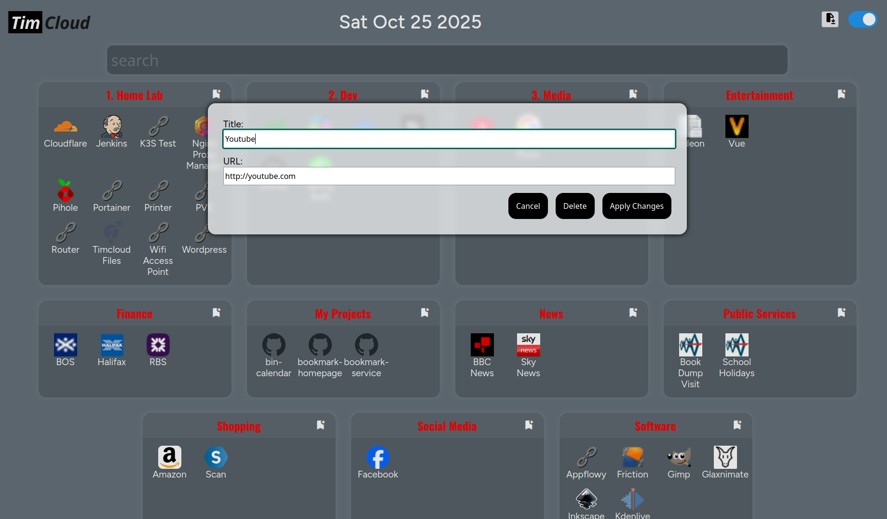
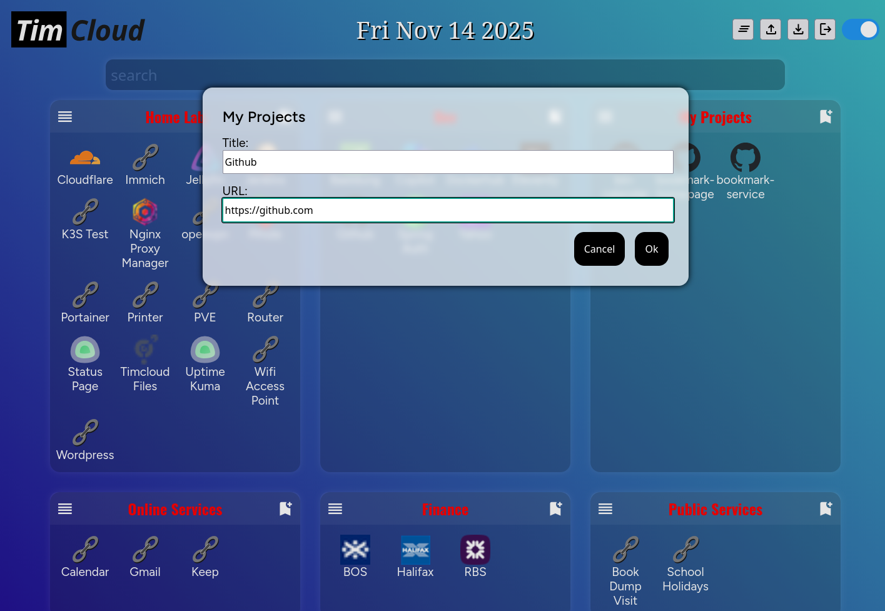

# Bookmark Homepage

## Summary

Front end react client for the [bookmark service](https://github.com/tstanford/bookmark-service)

## Screenshot in normal mode

## Screenshot in edit mode

## Screenshot showing adding a new bookmark

## Feature Backlog:

[Link to Backlog](project/feature.md)

